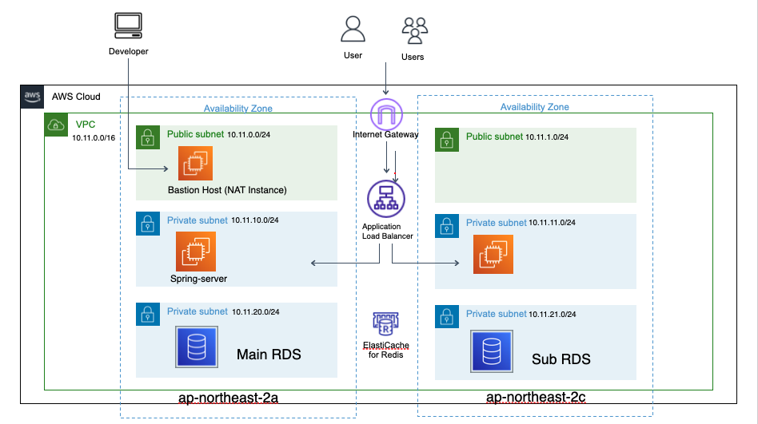

# AWS배포 방법

## 목표

- public, private 서브넷을 분리한 배포
- CodeDeploy를 사용한 배포자동화
- HTTPS 배포
- 퍼블릭 엑세스 차단 후 SDK를 사용한 이미지 관리

### 전체 과정
- 우선 VPC를 만들고 그 안에 public, private 서브넷을 각각 만든다.  
- 각 서브넷이 2개 이상인경우에는 같은 성격의 서브넷끼리 라우팅테이블로 연결한다.
    - public 에는 인터넷 게이트웨이를 생성해서 연결하고, private 서브넷에는 이후 만들 nat인스턴스인 bastion 인스턴스를 연결한다.  
- bastion 인스턴스를 nat로 만든다. nat gateway를 사용해도되지만 비용면에서는 nat 인스턴스가 유리하다.
    - 네트워킹에 소스/대상 확인 변경 옵션을 중지한다. bastion 인스턴스가 오로지 장벽의 역할만 담당할 수 있게 하기위함이다.
    - 그리고 private 서브넷 라우팅 테이블에 인스턴스를 추가한다.
- private 인스턴스를 구성한다. 퍼블릭 DNS는 비활성화해서 외부에서 접근할 수 없게한다. 
> **보안그룹 설정**  
   - bastion : 개발자가 서버로 접근하는 통로이자 요청을 걸러내는 장벽의 역할을 한다.  
   개발자가 접근하기 위한 SSH(22)포트를 개발자 IP에서만 허용하고  
   서버에서 오는 HTTP(80),HTTPS(443)만 허용한다. 

   - server : 제한적인 요청만 수행한다  
   bastion에서 오는 SSH요청과, 로드밸런서를 거쳐온 8080요청만 허용한다.  
> ㅤ

- 로드 밸런서를 생성한다.  
가용영역은 public 서브넷으로 설정하고 HTTP, HTTPS에 대한 모든 요청을 허용한다.  
대상그룹은 서버로 설정하고 리스너를 80, 443으로 설정한다.  
정적 웹페이지의 경우에는 alb의 dns로 접근해야한다.

---

- 기본 배포
    1. vpc 생성, public-private 서브넷 분리
        - IP4V CIDR은 VPC 내의 인스턴스 및 리소스에 할당되는 IP 주소의 범위를 결정하는 것이다.  
        뒤의 숫자가 작아질수록 (16 -> 12) 범위는 더 커진다.

    2. 라우팅테이블로 서브넷 연결, 인터넷 게이트웨이 설정
        - 라우팅 테이블 : 분리된 같은 성격의 서브넷을 연결한다.
        - 인터넷 게이트웨이 : 외부의 요청을 받는다.
    3. bastion 인스턴스 생성 - nat 인스턴스로 생성 -> 탄력적 IP 할당  
        - bastion 인스턴스 : bastion은 요새를 뜻한다.  
        따라서 서버가 아닌 요새, 장벽의 역할을 하며 private로 접근하는 요청을 선별해서 받는 역할을 한다. 
        - 즉 public으로 들어온 요청을 걸러서 private로 전달해야하는데  
        pravate내의 리소스와 통신하기 위해서는 public ip로 변환할 필요성이 생긴다.  
        aws에서는 이를 위해 nat gateway를 지원하지만 비용이든다는 단점이있다.

    4. private 라우팅 테이블 설정
        - bastion에서 오는 모든 요청을 받는다. bastion에서 요청을 한번걸러주기때문이다.  

    5. private 인스턴스 생성
    6. 로드밸런서 설정
        - 로드밸런서는 외부의 요청을 적절하게 분산하는 역할을 한다.  
        서버에 요청을 보내야하기 때문에 server 인스턴스의 인바운드 규칙에 로드밸런서 요청을 열어줘야한다.  
        - 요청을 보낼 대상 그룹을 추가해야한다. 대상 그룹에는 서버 인스턴스를 추가해준다.
        - 

    > NAT      https://docs.aws.amazon.com/ko_kr/vpc/latest/userguide/VPC_NAT_Instance.html
    
    7. 보안그룹 설정
        - *아웃 바운드는 모두 열어주고 인바운드로 통제한다.*
        - bastion host
            - 80 : http웹 요청
            - 443 : https 요청
            - 22 : SSH요청 - 본인 IP에서만.
        - private server
            - 22
            - 8080 : 서버를 실행시켜야한다.
        - 로드밸런서 : 모두 열어준다

- 배포 자동화
    1. RDS, S3 생성(h2사용시 S3만 있어도 된다.)
        - RDS 보안그룹 설정  
            - 내 IP - 로컬
            - server
            - (선택) bastion - workbench 확인용
        - RDS 생성에서 Mysql WorkBench 연결 테스트까지  
        [참고](https://aws.amazon.com/ko/premiumsupport/knowledge-center/rds-connect-ec2-bastion-host/)  
        vpc 설정하고 서브넷 그룹(private)을 생성해서 설정해준다.  
        rds는 프라이빗 서버와만 통신하고 보안그룹을 통해 bastion에서 사용할 수 있게 된다.  

    2. AWS IAM 사용자 계정 생성, 역할 생성 및 사용자 계정과 server 인스턴스연결
    3. Gradle.yml 작성 - 배포 설정  
        - github에서 생성할때는 기본적으로 main 브랜치에서 배포하려하므로 다른 브랜치에서 사용하려면 IDE로 따로 만들어주거나 해야한다.  
    4. appspec.yml 작성 - 배포 권한, 경로설정
    5. deploy.sh - 배포 로그관련 설정
        - 위 두 파일은 commit되어야한다. 배포에 사용되니까
        - application.yml파일이 필요하다. 비어있는 파일이라도 있어야한다.
    6. AWS CodeDeploy에서 애플리케이션과 배포 그룹을 생성해야한다.  
        - 배포그룹  
        앞서 생성한 IAM역할을 설정해주고 서버가 될 인스턴스인 private 인스턴스를 태그에서 추가해준다.  
    

---
### 22.10.28
- HTTPS 배포
    - 준비물
        - Route 53
        - 도메인(ex 가비아)
        - 인증서
    - 과정
        1. 도메인을 구매한다.
        2. Route 53에 호스팅 영역 설정.
        3. NS(NameServer)에 있는 값을 도메인을 구매한 곳에서 설정한다.
        4. ACM(aws 인증 매니저)에서 인증서 등록
            - 주의 : 도메인 이름을 그냥 설정해도 되지만, 와일드카드(*)를 사용해서 서브도메인을 한번에 등록하면 좋다.   
            ex) *.kdksandbox.shop
        5. 로드밸런서에서 443(https)설정, Forward에서 타겟그룹을 설정하고, ACM 설정
            - 80포트는 443으로 리다이렉트 설정해주면 더 깔끔하다.
        6. Route 53에 설정한 호스팅 영역에 레코드를 추가해서 ALB를 설정해준다.

- S3에 이미지 업로드
    - 과정
        1. aws관련 의존성 추가
        2. aws 접근을 위한 AwsConfig생성
        ```java
        @Configuration
        public class AwsConfig {
            @Value("${cloud.aws.credentials.access-key}")
            private String iamAccessKey;
            @Value("${cloud.aws.credentials.secret-key}")
            private String iamSecretKey;
            @Value("${cloud.aws.s3.region.stack}")
            private String region = "ap-northeast-2";

            @Bean
            public AmazonS3Client amazonS3Client(){
                BasicAWSCredentials basicAWSCredentials = new BasicAWSCredentials(iamAccessKey,iamSecretKey);
                return (AmazonS3Client) AmazonS3ClientBuilder.standard()
                        .withRegion(region)
                        .withCredentials(new AWSStaticCredentialsProvider(basicAWSCredentials))
                        .build();
            }
        }
        ```
        3. amazonS3Client를 이용해서 이미지 저장 메서드 추가
        ```java
            String storeFilename = fileStore.storeFile(file);

            ObjectMetadata objectMetadata = new ObjectMetadata();
            objectMetadata.setContentType(file.getContentType());
            objectMetadata.setContentLength(file.getSize());

            amazonS3Client.putObject(
                    new PutObjectRequest(S3Bucket,storeFilename,file.getInputStream(),objectMetadata)
                            .withCannedAcl(CannedAccessControlList.PublicRead)
            );

            String imagePath = amazonS3Client.getUrl(S3Bucket, storeFilename).toString();
        ```

        4. 버킷 권한 설정
            - 퍼블릭 엑세스 차단(지금 방법은 ACL 퍼블릭 엑세스를 풀어줘야한다)
            - 버킷 정책 설정  
            ```json
            {
                "Version": "2012-10-17",
                "Id": "Policy1666940934219",
                "Statement": [
                    {
                        "Sid": "Stmt1666940930169",
                        "Effect": "Allow",
                        "Principal": "*",
                        "Action": [
                            "s3:DeleteObject",
                            "s3:GetObject",
                            "s3:ListBucket",
                            "s3:PutObject",
                            "s3:PutObjectAcl"
                        ],
                        "Resource": [
                            "arn:aws:s3:::kdk-first-s3",
                            "arn:aws:s3:::kdk-first-s3/*"
                        ]
                    }
                ]
            }
            ```
        5. 객체 소유권 편집
            - ACL활성화
        - CORS 설정  

        > 퍼블릭 엑세스 차단  
        현재 S3는 퍼블릭 엑세스가 일부 차단되어있지않다. 따라서 외부에서 데이터 접근이 가능하다.  
        외부에서 접근할 수 없게 퍼블릭 엑세스를 차단하는 것이 원칙이다.  
        대표적인 방법으로는 presignedUrl를 받아와서 제한을 두어 자료를 가져오는 방법이 있다.


---

- 트러블슈팅 : 221027
    - bastion 인스턴스 접속 불가  
    : SSH로 인스턴스에 접근하려하니 시간초과가 발생했다  
    -> 탄력적 IP를 할당하지 않고 private 주소로 요청해서 그랬다.  

    - 배포도 성공적이고 로드밸런서 보안그룹도 정상적인데 배포 URL로 접속이 안되는 문제  
    : 가용영역을 private로 설정했다. 당연하게도 public으로 설정해야 접근이 된다.  

    - 배포자동화 배포 단계에서 오류  
    : IAM 사용자 설정, 역할 설정을 완료하고 서로 연결을 해두지 않았다.  
    그리고 IAM설정을 하면 codedeploy를 재시작해줘야 한다.

- 트러블슈팅 : 221028
    - ACL 관련 오류
        - 배포는 되었는데 이미지 업로드시 ACL관련 오류가 발생했다.  
        퍼블릭 엑세스 관련 문제인 것 같아서 수정했지만 그대로였다.  
        알고보니 객체 소유권 편집을 해줘야했다.
    - 시큐리티에서 "//"를 받지 못하는 문제
        - 기존에는 이미지를 파일이름만 저장해서 수정하는 과정에서 발생한 문제였다.  
        전체 링크를 저장하도록 해서, 템플릿에도 전체 링크를 받도록 수정했다.

- 트러블슈팅 : 221126
    - bastion서버, private서버 접근 불가  
        - bastion에서 private에 접근하려하니 시간초과도 아닌 계속 입력을 대기하는 문제가 발생했다.  
        그러다가 나중에는 bastion서버 접근도 동일한 오류가 났다.  
        알고보니 그냥 오타였다. 맥의 Page앱에서 따옴표를 다른 모양으로 인식해서 닫히지않은 따옴표를 계속 대기한것이었다.

- 트러블슈팅 : 221202  
    - 생성한 rds와 연결 실패(Mysql WorkBench)  
    Mysql WorkBench를 사용해서 연결테스트를 하는데 계속 실패했다.  
    인바운드도 열려있고 서브넷도 제대로 설정한것같은데 실패하길래 rds생성을 잘못했나 싶어 여러번 깔았다 지웠다.  
    - 해결 : connection method를 잘못설정했다.  
    Standard TCP/IP가 아니라 Standard TCP/TP over SSH를 선택해야했다.  

- 트러블(해결) : 221203
    - 배포자동화 첫단계에서 계속 실패한다.  
    codedeploy 로그를 살펴보니 iam 역할관련 문제인것같은데  
    예전에 사용한것을 그대로 사용하는 만큼 역할은 제대로 설정되있을텐데 잘 되지않는다.  
    어제도그렇고 기존에 사용하던것을 사용하다보니 여러 문제가 있었다.  
    처음부터 다시하는게 좋아보인다.
    
- 트러블슈팅 : 221206  
    - 이전에 한 모든 것을 삭제하고 vpc생성부터 시작했다.  
    새로다시 시작하면서 안다고 생각하고 지나간 것들의 역할에 대해서 제대로 이해하게되었다.  
    
    - 모든 작업을 마치고 배포자동화 이전에 테스트목적으로 예전에 만든 프로젝트를 배포해봤는데 주소로 접근이 되지 않았다.  
    보안그룹의 탓이라고 생각되어 이것저것해보다 모든 트래픽까지 열어줬지만 결과는 동일했다.  
    알고보니 내가 만든 프로젝트가 서버/클라이언트가 나눠지지않은 어플리케이션이라 정적 웹페이지를 배포할때는 해당 주소로 접근해도 어떤 정보도 확인할 수 없는게 정상이었다.  
    정적 웹페이지를 배포하기위해서는 S3을 사용하거나, ALB를 사용해야했는데  
    문제는 난 ALB를 이미 적용했다.  
    알고보니 웹페이지 접근 요청은 ALB를 통해서 해야했다.  
    여태까지 모든 요청은 public을 통해서 private로 향한다고 오해했던것이다.  
    - 리스너  
    그럼에도 접속이되지않아 로드밸런서를 살펴보니 리스너가 8080이라고 되어있었다.  
    외부요청이기때문에 80으로 설정해야했는데 오타가 난듯하다.

- 트러블슈팅 : 221207
    - 배포그룹 태그 이름  
    인스턴스 태그 이름을 임의로 지정했더니 인스턴스를 찾지못했다.  
    "Name"이라고 반드시 적어줘야한다.
    - 토요일(221203)에 계속 배포에 실패했던 이유는..  
    인스턴스에 역할을 설정해주지 않아서였다.  
    - **502 혹은 504 오류 발생**
        - github action에서 build를 확인하고, codedeploy에서 배포 성공을 확인했는데 alb주소로 접근하니 502, 504오류가 발생했다.  
        - 검색해보니 대상그룹을 잘못선택하면 발생하는 alb관련 오류라고 한다.  
        그래서 8080포트도 추가해봤는데 여전히 오류는 동일했다.  
        - 아무리 고민해도 alb를 더 고칠 부분은 없어보였다.  
        혹시나, 혹시나 싶어서 애초에 배포가 된건 맞는지 확인해보기로했다.  
        deploy.log 를 확인해보니 db관련 오류로 어플리케이션이 실행되지않았다는 것을 알게되었다.  
            - application.yml에서 생성한 dbsource를 mysql url로 수정하지않아서 인식에서 오류가 발생했다.  
            > url 작성법  
            ```yml
            url : jdbc:mysql://[rds데이터베이스주소]:[DB포트]/[스키마이름]?useSSL=false&characterEncoding=UTF-8&serverTimezone=UTC
            #예시
            url : jdbc:mysql://my-refrigerator-db.cpsiwozgbc5e.ap-northeast-2.rds.amazonaws.com:3306/refrigerator?useSSL=false&characterEncoding=UTF-8&serverTimezone=UTC
            ```
        - Batch관련  
        ```'batch_job_instance' doesn't exist```  
        batch를 사용하기 위해서는 데이터베이스에 springbatch 정보를 저장하는 테이블을 생성해줘야한다.   
        다음 설정을 추가해서 자동으로 테이블이 생성되게 해주면 된다.  
        ```yml
        batch:
            jdbc:
                initialize-schema: always
        ```
    - 도메인 연결 관련  
    ACM에서 등록한 도메인을 ALB에 연결함으로써 도메인을 통한 접근이 가능해진다.  
        - OAuth2의 redirectUrl을 등록해주지 않아서 오류가 발생했는데  
        https가 아닌 http주소로 추가해야 작동했다.  
        이를 변경해야할것같다.
        
    
---
### local -> remote 파일전달
```
scp -i '전달할때 사용될 key' '전달할 파일' ec2-user@address:/home/ec2-user

```
